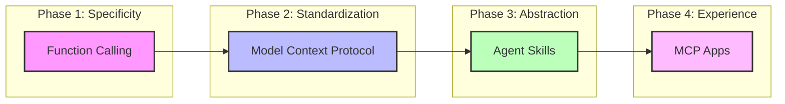

I develop AI tools for geotechnical engineering, and if there is one constant in this work, it is the blistering pace of change in the developer ecosystem. It is not just the models that are evolving; the very paradigms we use to build with them are shifting beneath our feet.

Reflecting on one of my own project's architecture, asking "how do I connect this LLM to my engineering tools?" has had four different answers in rapid succession. This post explores that evolution, not just as a chronicle of new features, but as a lesson in the fragility of "modern" software engineering in the age of AI.

## My Journey Through The Evolution of AI Tooling

My journey mirrors the industry's maturity curve, moving from low-level manual integrations to high-level, standardized abstractions.

### Function Calling

Creating AI tools initially meant relying on **Function Calling**. This was the "assembly language" era of LLM integration. We wrote manual JSON schemas for every single tool, essentially teaching the model the exact syntax of our APIs. While it was a breakthrough that allowed models to "act," it was incredibly brittle.

The bottleneck wasn't just verbosity; it was tight coupling. The model's ability to call a function was directly tied to the specific phrasing of a prompt and the specific schema of a tool. If the model hallucinated a parameter or if the API changed slightly, the entire workflow broke. We were building fragile pipelines where the "intelligence" was hard-coded into the plumbing.

### Model Context Protocol (MCP)

Then came the [Model Context Protocol (MCP)](https://modelcontextprotocol.io/), introduced by Anthropic in November 2024 and later [donated to the Linux Foundation](https://www.anthropic.com/news/donating-the-model-context-protocol-and-establishing-of-the-agentic-ai-foundation) in December 2025. MCP represented a shift towards an "Operating System" model for AI tools, forcing a pivot from writing custom integrations to building standardized "drivers."

The significance of MCP wasn't just technical; it was structural. It decoupled the *tool* from the *client*. Suddenly, a geotechnical analysis tool didn't need to be written *for* Claude or *for* Gemini specifically. It just needed to speak MCP. This standardization was crucial, but it solved the connectivity problem, not the logic problem. We had a better way to plug things in, but we were still micromanaging how they were used.

### Agent Skills

While MCP was still gaining broad adoption, Anthropic launched [**Agent Skills**](https://docs.anthropic.com/en/docs/agents-and-tools/agent-skills) in October 2025 to solve the logic problem. If MCP represents the tools in a workshop, Agent Skills represent the *craft*. Similar concepts have since been adopted by platforms like GitHub Copilot and VS Code.

The realization here is that standard *workflows*—linear steps like "Step A -> Step B -> Step C"—are too rigid for true intelligence. Geotechnical engineering problems rarely follow a straight line. By defining "Skills" (modular capabilities like "perform slope stability analysis" or "interpret soil test data"), we moved from *imperative* programming to *declarative* intent. We give the agent a toolbox and a goal, and let *it* orchestrate the steps. This shift from "scripting" to "enabling" is perhaps the most profound change in how we build AI applications.

### MCP Apps

Most recently, [**MCP Apps**](https://modelcontextprotocol.io/docs/extensions/apps) have begun to emerge. While the development of MCP Apps is still in its nascent stages, its implications are significant. Throughout each of the above phases, I consistently realized that for specialized domains like geotechnical engineering, a dedicated frontend UI was absolutely necessary because AI chatbots simply lacked the domain-specific requirements needed for complex engineering tasks.

However, MCP Apps challenge this assumption. They turn AI chatbots into dynamic UI interfaces because one can develop UIs for their specific tools that get displayed directly in hosts like Claude, Goose, and VS Code. Suddenly, a dedicated frontend seems unnecessary. A geotechnical engineer doesn't want to describe a soil profile in prose; they want to see it. MCP Apps allow the tool to render that profile right inside the chat window. The "Chatbot" effectively becomes the "App," handling domain-specific interactions without forcing the user to leave the conversation.

## Conclusion: The Trap of "Best Practices"

The lesson from this journey isn't just to adopt MCP or Agent Skills. It is to recognize that today's "standard" is tomorrow's legacy code.

If I had bet everything on the specific syntax of early function calling, my codebase would be obsolete today. The same risk applies to MCP. The actual skill in AI engineering right now isn't mastering a specific toolchain, but building for **adaptability**. We must build modular systems where the "intelligence layer" is loosely coupled to the "application layer."

We don't know what comes after MCP. But we know that if we build rigid, monolithic systems, we won't be able to use it when it arrives. The goal is to build tools that are robust enough to work today, but flexible enough to be reinvented tomorrow.
